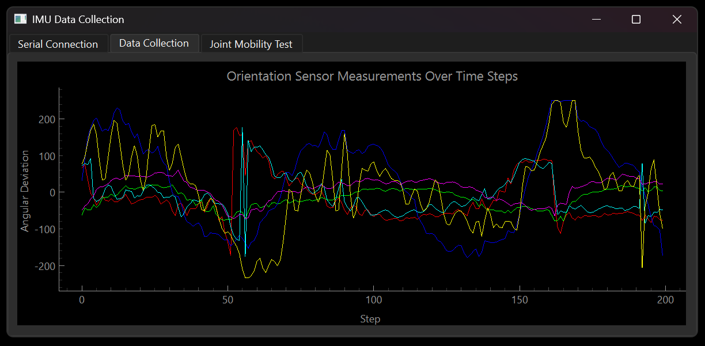

# RheumActive





RheumActive (a play on the word 'rheumatic', that is, 'relating to or caused by rheumatism') is a system designed to track the joint range of motion for people with rheumatoid arthritis, like myself, and ultimately improve the quality of life for people with this disease. Using MPU-6050 accelerometers and an Arduino Nano ESP32, this software enables live data visualization and provides insights into joint movement, angular differences, and more. This repository contains the software required for collecting, processing, and visualizing data from the sensors.

Refer to [this](https://patrickcap.github.io/projects/rheumactive/) page for more information.

---

## Disclaimer

The devices and designs provided are shared freely for educational and informational purposes. The creators do not accept any liability for any injury, damage, or loss caused by the use of these designs

---

## Features

- **Joint Mobility Tracking:** View the progress of your joint mobility with tests, history, high scores, visualisations and more!
- **Real-Time Data Visualisation:** Collect roll, pitch, yaw, acceleration, and angular velocity data from multiple MPU-6050 sensors.
- **Portable and Wearable:** Designed to work with a compact, wearable system powered by Arduino Nano ESP32.
- **Customizable Codebase:** Modify the software to adapt to different applications or sensor configurations.

---

## Table of Contents

1. [Hardware Requirements](#hardware-requirements)
2. [Software Requirements](#software-requirements)
3. [Installation](#installation)
4. [Getting Started](#getting-started)
5. [Contributing](#contributing)
6. [License](#license)

---

## Hardware Requirements

- **Arduino Nano ESP32 (ABX00083)**
- **MPU-6050 Accelerometers (x2)**
- **Breadboard and Jumper Wires**
- **USB-C to USB-C/A Cable**
- **Laptop (Windows/Mac/Linux)**

---

## Software Requirements

- **Arduino IDE** (version 1.8.19 or later)
  - Install from [Arduino Official Website](https://www.arduino.cc/en/software)

---

## Installation

### 1. Clone the Repository
```bash
git clone https://github.com/your-username/rheumactive.git
cd rheumactive
```

### 2. Set Up the Arduino
- Open the Arduino IDE.
- Install the necessary libraries using the Library Manager:
  - Search for "Adafruit MPU6050" and install it.
- Upload the provided `arduino_sketches/best/Arduino_Sketch_Dual_MVP_01.ino` file to the Arduino Nano ESP32.

---

## Getting Started

1. **Wire the Sensors:**
   - Wire the MPU-6050 sensors to the Arduino Nano ESP32 as follows (MPU-6050 on left, Arduino Nano ESP32 on right):
      - For both MPU-6050:
         - VCC -> 3.3V
         - GND -> GND
         - SCL -> A5
         - SDA -> A4
      
      - For MPU-6050 #1: AD0 -> 3.3V
      - For MPU-6050 #2: AD0 -> GND

   - Ensure each sensor has a unique I2C address (`AD0` pin set appropriately).

2. **Provide a Connection to the Sensors:**
   - Connect the Arduino Nano ESP32 to your machine via a USB-C to USB-C/A cable.

3. **Run the Program:**
   - In terminal, open the repository and navigate to the `src` directory.
   - Execute the command `python main.py` to run the program.

4. **Connect to the Sensors:**
   - In the Serial Tab of RheumActive, choose the correct communication (COM) port (it should be the only one available) and select 'Connect'. If successful, the "Status" should change from "Not Connected" to "Connected".

---

## Contributing

We welcome contributions to make RheumActive even better! Here’s how you can contribute:

1. Fork the repository.
2. Create a new branch for your feature or bug fix:
   ```bash
   git checkout -b feature-name
   ```
3. Commit your changes and push to your branch:
   ```bash
   git commit -m "Add new feature"
   git push origin feature-name
   ```
4. Open a pull request describing your changes.

---

## License

This project is licensed under the MIT License. See the [LICENSE](LICENSE) file for details.

---

## Acknowledgments

- Inspired by individuals seeking innovative ways to manage rheumatoid arthritis.
- Thanks to the open-source community for the libraries and tools that made this project possible.

---

For further questions or suggestions, feel free to open an issue or contact the repository owner.

